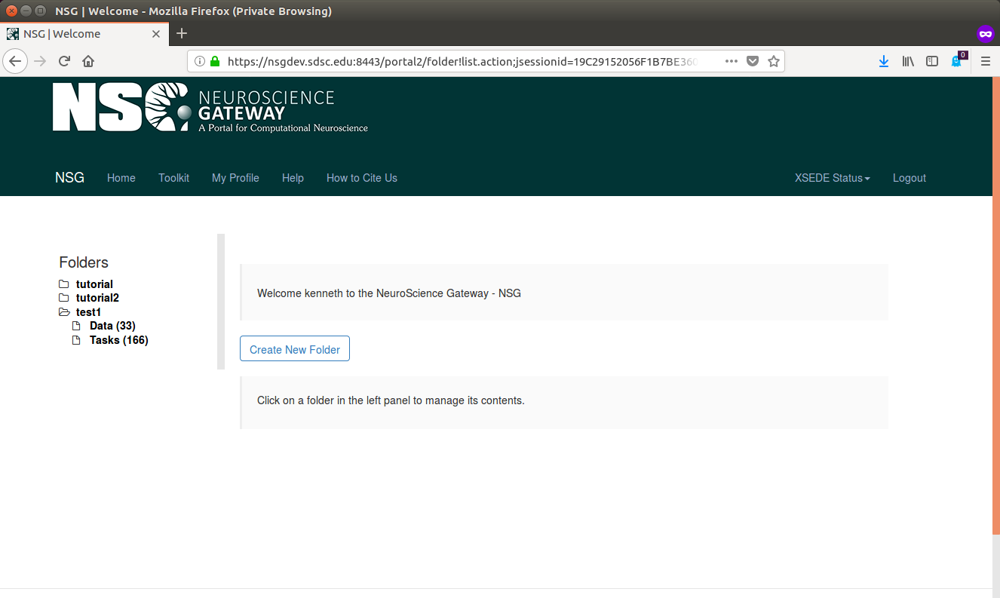
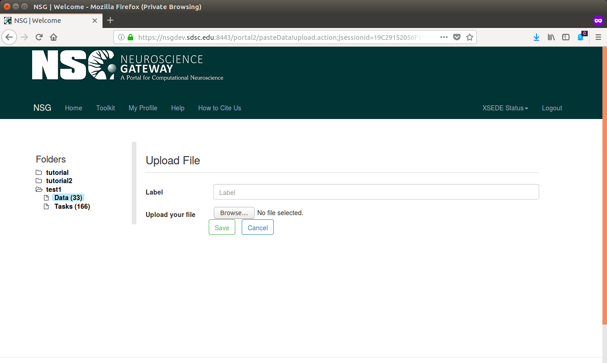
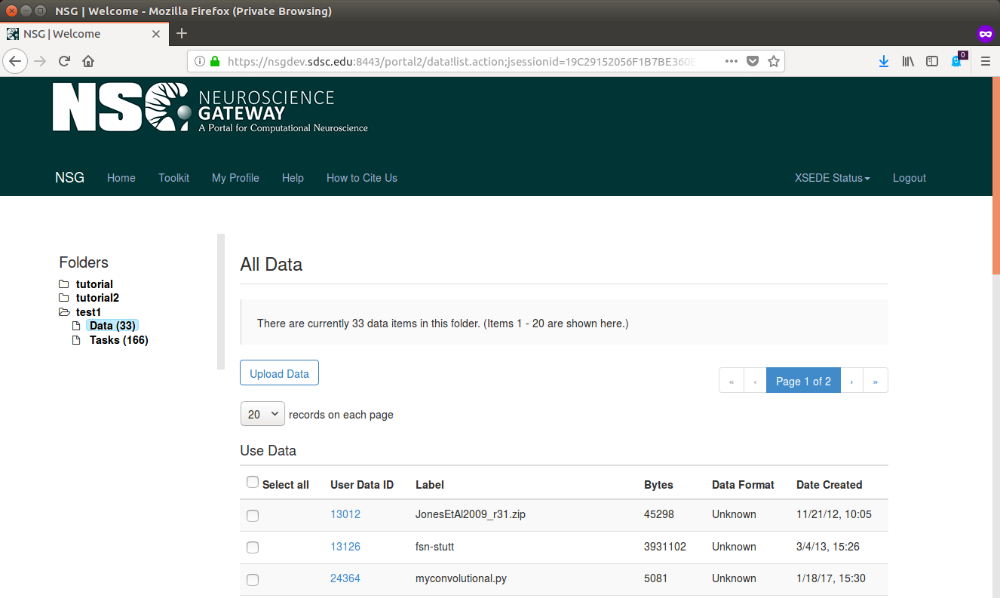

All Tools in NSG Portal take input code/data in the form of a zip archive.

To create a zip archive from an existing directory, do the following:
~~~
$ cd datadir
$ cd ..
$ zip -r input datadir
~~~

This should create an input.zip file.  That file would be selected for
upload to NSG Portal in the data upload process.

This file (or one downloaded from [relica_demo_10.zip](http://users.sdsc.edu/~kenneth/madison.2018/relica_demo_10.zip)) can be used as input.  The relica
job is from Swartz Center for Computational Neuroscience at UCSD.
A [tutorial](https://sccn.ucsd.edu/wiki/EEGLAB_on_NSG) for running
this analysis is available.

> **Log in to your NSG account at the [Login Page](https://nsgdev.sdsc.edu:8443/portal2).**
> **Create a Folder.**

***

***

> **Folders contain sections for Data and Tasks.**


[Folder Management](https://nsgdev.sdsc.edu:8443/portal2/folder!list.action)


> **Go to the Data section and click on Upload Data, then browse to the desired input.zip file and confirm.**

***

***

> **The file should show up in the data list.**

***

***

