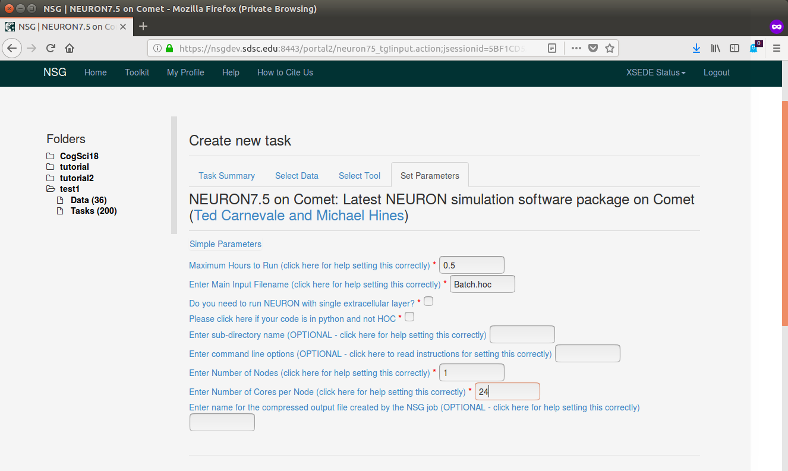
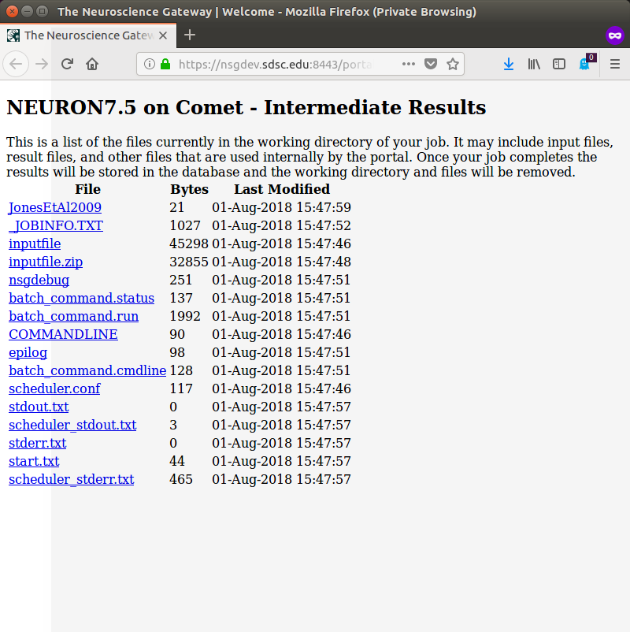

> **To run a simulation/analysis, a Task should be created.  This is
> done in the Tasks section.**

***

***

> - **Click on "Create New Task"**

***

***

> - **Enter a Description**
> - **Click on "Select Data", select an input file, and click "Select Data"**

***

***

> - **Click on "Select Tool", select a Tool**

***

***

> - **Click on the Parameters Set button, enter Hours to Run, Main Input Filename,
Nodes and Cores, then click "Save Parameters"**

***

***

> - **Click "Save and Run Task"
> You can check status of the work by going to the Task List**

***

***

> - **and clicking on "View Status" for the Task.**

***

***

> **You can view output files of the running job by clicking on "Intermediate Results".**

***

***

> **Once the Task has completed, you should receive email.**
