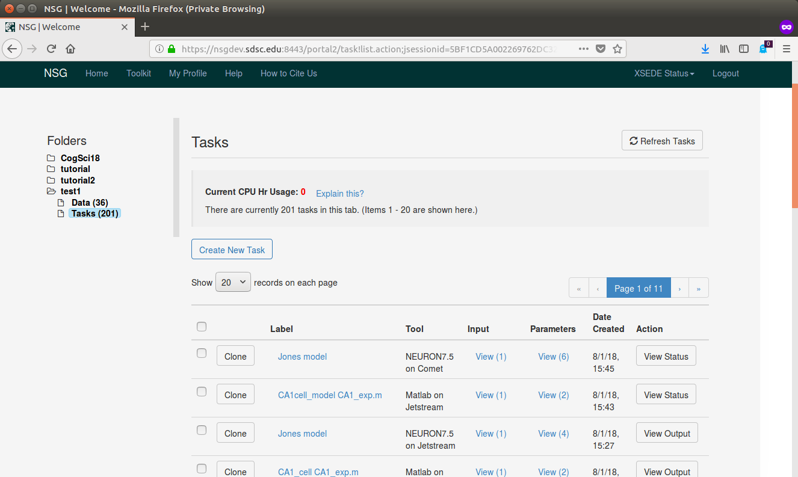
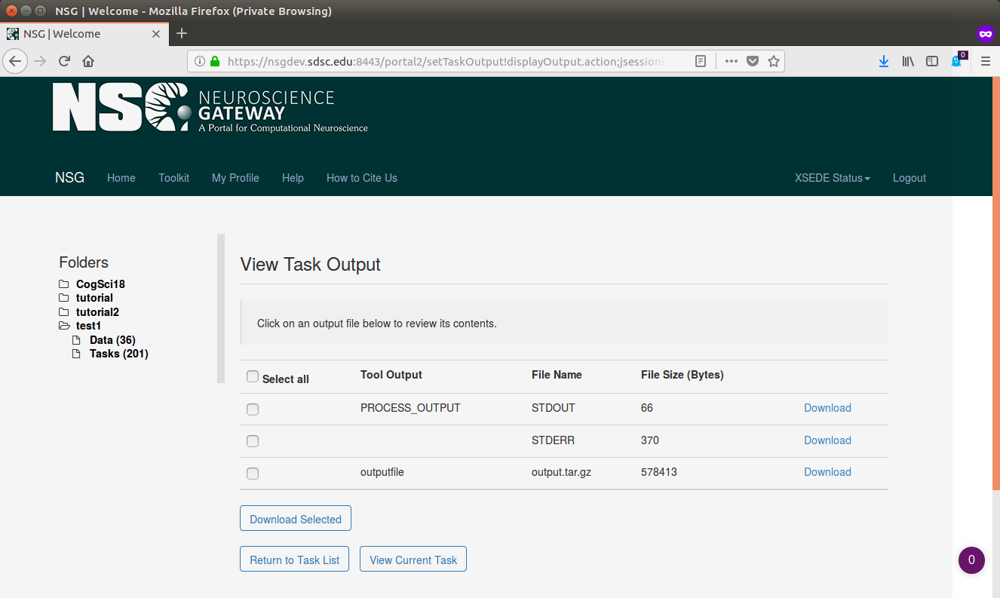

> **Go to the Task List and click on the "View Output" button for a completed Task.**

***

***

> **A list of possible downloads is presented.*

***

***
 
> - **Click on "Download" for output.tar.gz.  Follow browser
> prompts of putting the file in a desired location on your local machine.  Once
> downloaded, you will need to unzip and untar the archive.  For a Linux machine,
> this can be down with:**

~~~
$ mkdir output
$ cd output
$ tar zxf ../output.tar.gz
~~~
{: .language-bash}

> **Three output images generated by the EEGLAB job:**

***

***

***

***

> **Bonus Exercise**
> [test0.hoc](../files/test0.hoc)

